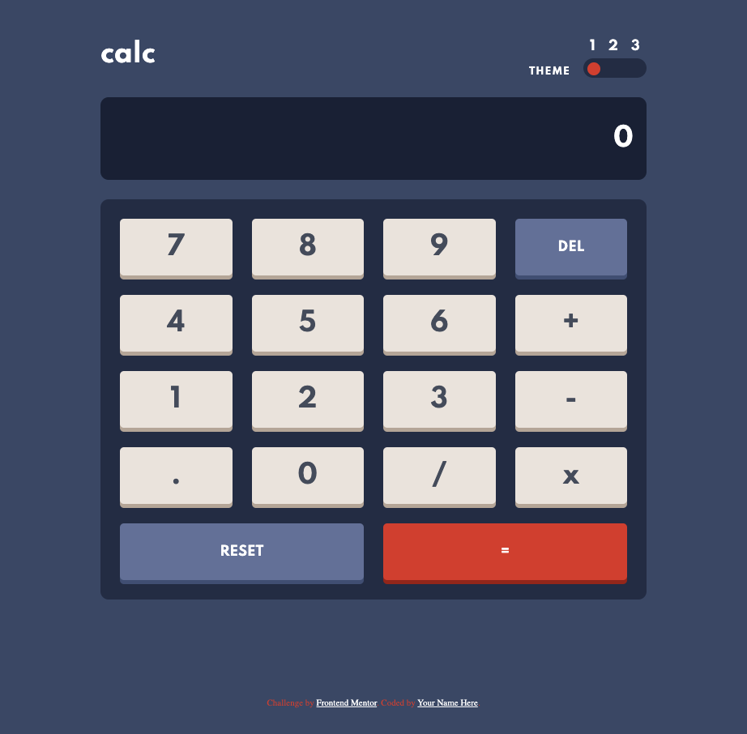
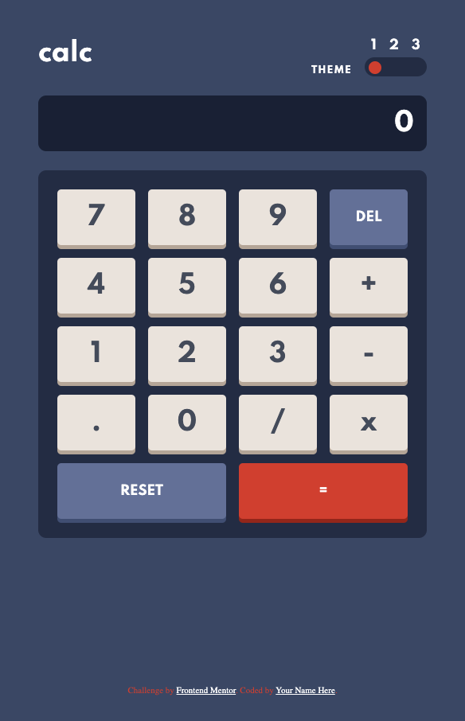

# Frontend Mentor - Calculator app solution

This is a solution to the [Calculator app challenge on Frontend Mentor](https://www.frontendmentor.io/challenges/calculator-app-9lteq5N29). Frontend Mentor challenges help you improve your coding skills by building realistic projects. 

## Table of contents

- [Overview](#overview)
  - [The challenge](#the-challenge)
  - [Screenshot](#screenshot)
  - [Links](#links)
- [My process](#my-process)
  - [Built with](#built-with)
  - [What I learned](#what-i-learned)
  - [Continued development](#continued-development)
  - [Useful resources](#useful-resources)
- [Author](#author)
- [Acknowledgments](#acknowledgments)

**Note: Delete this note and update the table of contents based on what sections you keep.**

## Overview

### The challenge

Users should be able to:

- See the size of the elements adjust based on their device's screen size
- Perform mathmatical operations like addition, subtraction, multiplication, and division
- Adjust the color theme based on their preference
- **Bonus**: Have their initial theme preference checked using `prefers-color-scheme` and have any additional changes saved in the browser

### Screenshot

DeskTop:

### Links

- Solution URL: [Add solution URL here](https://your-solution-url.com)
- Live Site URL: [Add live site URL here](https://your-live-site-url.com)

## My process

I attacked the front end first, implementing all the styles and then hit the JS functionality. I'm not sure how performant my code is (and it certainly isn't stylish). I didn't want to write a hundred on-click functions so I used a for loop to run through all the items in a class (like "keys" and "operators") and I couldn't think of a way around using eval, although from what I googled it seems like window.eval is OKish.

### Built with

- Semantic HTML5 markup
- CSS custom properties
- Flexbox
- CSS Grid
- Mobile-first workflow

### What I learned

This was a really fun project!

I have not used html attribures before ([data-theme]), nor had I used prefers-color-scheme media queries so lots of googling ensued. I got the media queries set up first and then later figured out how to override in JS. 

I used grid-auto-flow for the first time -- tip of the hat to brasspetals -- was intrigued by that when looking at her code for the stats card.

I was mostly tickled to practice some JS after working in React. Lotta googling, but fun to get it working.

### Continued development

Definitely more JS projects and back to React.

### Useful resources

- [Stack Overflow](https://stackoverflow.com/questions/13893138/javascript-click-event-listener-on-multiple-elements-and-get-target-id) - This helped me with applying the same on-click function to more than one key.
- MDN Web Docs helped me with prefers-color-scheme and many other things.
- [Blog about dark mode](https://lukelowrey.com/css-variable-theme-switcher/) - This got me over the hump overriding prefers-color-scheme.

## Author

- Frontend Mentor - [@techmeg](https://www.frontendmentor.io/profile/techmeg)

## Acknowledgments

As noted above, stole grid-auto-flow from brasspetals.
